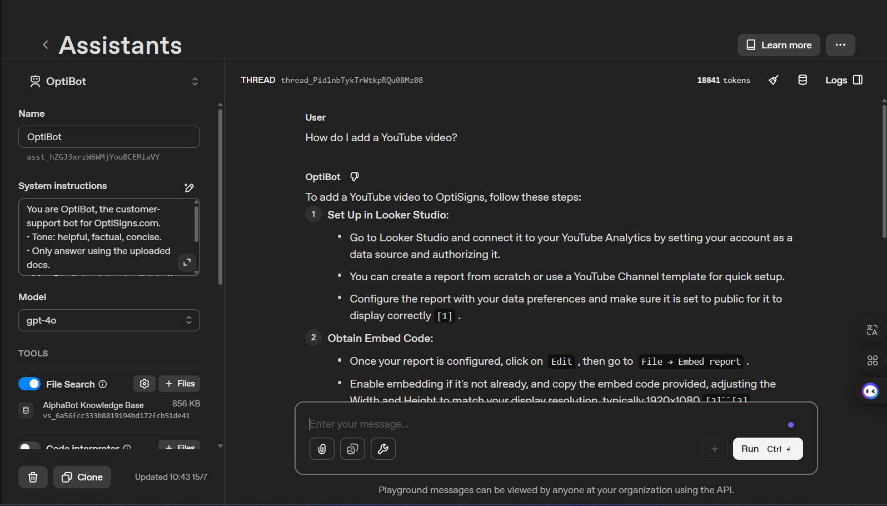

# AlphaBot - OptiSigns Support Assistant

RAG-based chatbot that answers questions about OptiSigns using your uploaded documentation.

[](https://github.com/MinTieeeen/AlphaBot/actions)

## Quick Start

```bash
# Install dependencies
pip install -r requirements.txt

# Configure
cp .env.sample .env
# Add your OPENAI_API_KEY to .env

# Run scraper (downloads articles)
python main.py --scrape

# Upload to vector store
python main.py --upload

# Test the assistant
python main.py --test "How do I add a YouTube video?"
```

## Docker

```bash
# Build
docker build -t alphabot .

# Run (one-shot, exits after completion)
docker run -e OPENAI_API_KEY=sk-xxx alphabot
```

## Architecture

| File | Purpose |
|------|---------|
| `main.py` | Entry point, orchestrates workflow |
| `scraper.py` | Fetches articles via Zendesk API |
| `uploader.py` | Uploads MD to OpenAI Vector Store |
| `assistant.py` | Tests chatbot via API |
| `content/` | Cached markdown files |

## Chunking Strategy

Files are split by paragraphs (double newlines), combined until 1000 chars, with 200 char overlap. This preserves semantic context while keeping chunks manageable.

## Daily Job

Automated daily job runs at 8 AM UTC via GitHub Actions.

**Features:**
- Delta detection (only scrape/upload changed articles)
- Log counts: added, updated, skipped
- Commits content changes to git

**Job Logs:** https://github.com/MinTieeeen/AlphaBot/actions

## Screenshot


